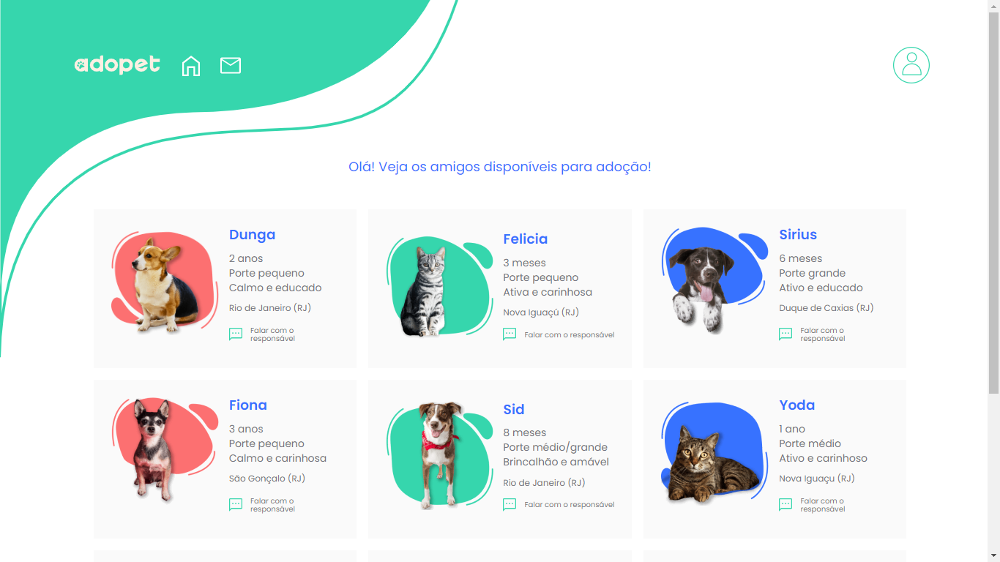
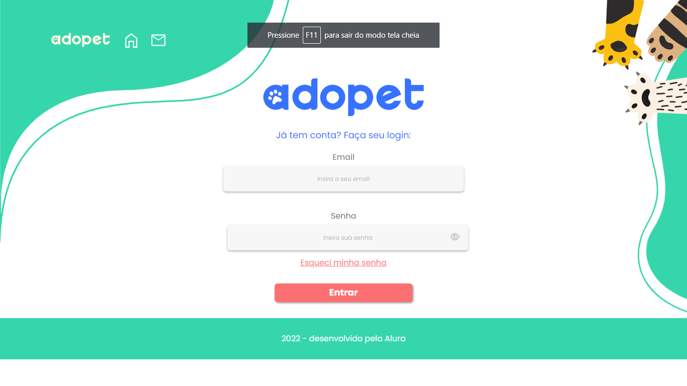

# AdoPet

## Hello world \o/
Hi everyone, i'd like to thank you all for having a look on my project, it has been a real challenge for me but made me growth a lot as a professional dev, even by all the struggle and time spent...it was all worth it at the end of de day :) 

## The project
It's a highly html and css focused project with the core idea of consolidating the knolege with those technologies by crating layouts with multiple strategies and concepts, such as css flexbox, grid, responsive design, forms, etc. A little bit of javascript have been implemented in the middle of de development for the show/hide password functions. 

This project is a front-end challenge made by **Alura**

Challenge creators:  
**- Monica Hillman** 
**- Antônio Evaldo**

## How does it work ?
The web application built in this project is an pet adoption site where the user can sign in or signup firstly and then choose a pet from the home page for adoption. After that selection the user has to get in touch with the organization in the message page to continue the process. All the pages are responsive so they can be seen at **any screen size or device**.

**warning: the main goal is to build a html and css project, so the form validation features have not yet been implemented**

## Project design

**Fisrt page** 
 
 
 **Home page** 
 
   
 **Login page** 
 
